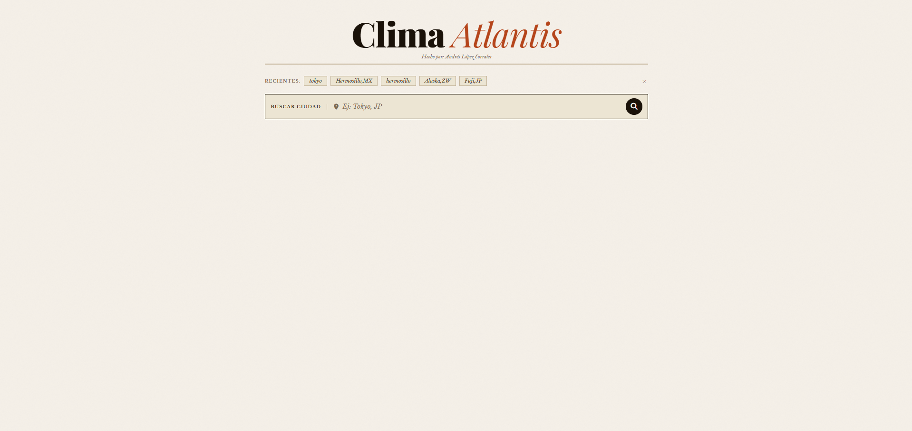
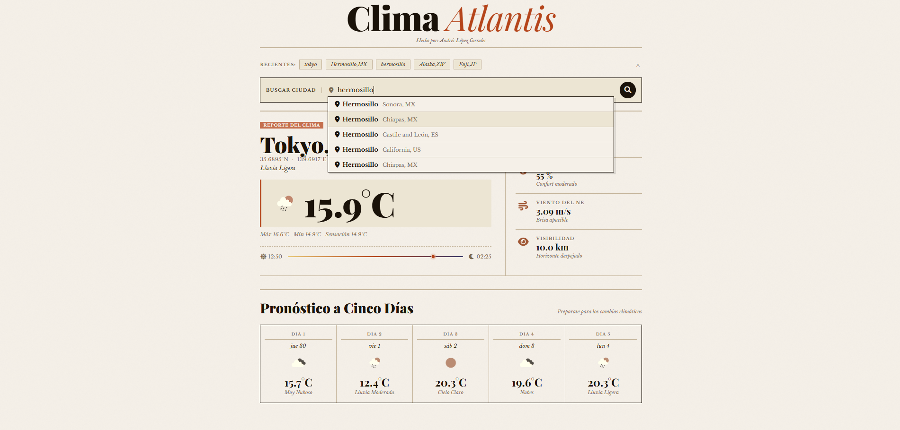
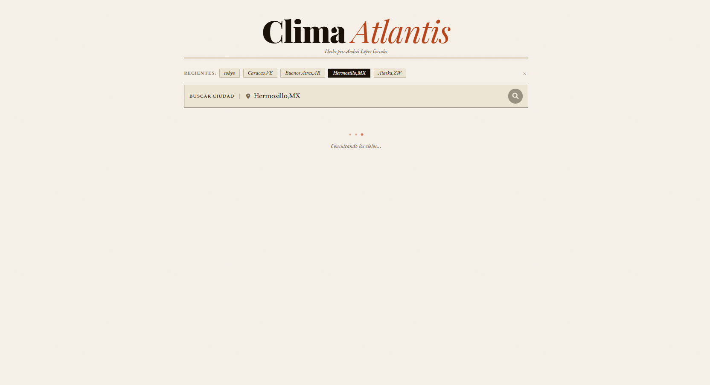
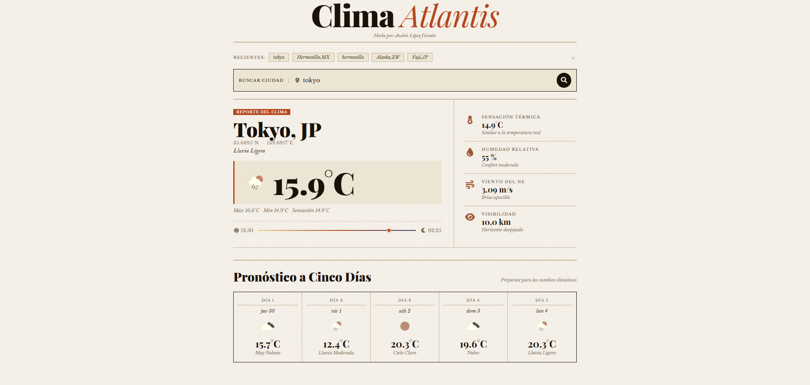
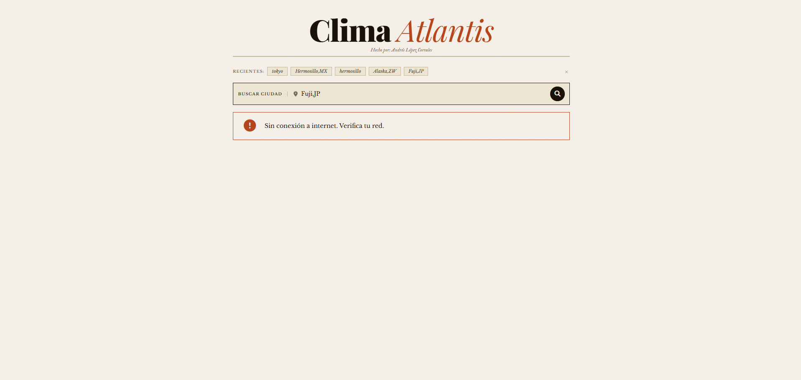

# Clima Atlantis

> _Hecho por: Andrés López Corrales_

Single Page Application del clima construida en Angular + SCSS + Typescript. Permite buscar cualquier ciudad del mundo y consultar temperatura actual, sensación térmica, humedad, viento, visibilidad y pronóstico extendido de 5 días con datos en tiempo real.

---

## Screenshots








---

---

## Tabla de contenidos

- [Tecnologías](#tecnologías)
- [Requisitos previos](#requisitos-previos)
- [Instalación](#instalación)
- [Configuración](#configuración)
- [Estructura del proyecto](#estructura-del-proyecto)
- [Funcionalidades](#funcionalidades)
- [API utilizada](#api-utilizada)

---

## Tecnologías

| Tecnología         | Versión       | Uso                                          |
| ------------------ | ------------- | -------------------------------------------- |
| Angular            | 17+           | Framework principal (standalone)             |
| TypeScript         | 5+            | Tipado estático                              |
| SCSS               | —             | Estilos con variables y mixins               |
| OpenWeatherMap API | 2.5 / Geo 1.0 | Datos meteorológicos en tiempo real          |
| RxJS               | 7+            | Programación reactiva (Observable, forkJoin) |

---

## Requisitos previos

- Node.js 18+
- Angular CLI 17+
- API Key gratuita de [OpenWeatherMap](https://openweathermap.org/api)

---

## Instalación

```bash
# Clonar el repositorio
git clone https://github.com/AndresLopezCorrales/clima-atlantis.git
cd clima-atlantis

# Instalar dependencias
npm install

# Iniciar servidor de desarrollo
ng serve --open
```

---

## Configuración

1. Regístrate gratis en [openweathermap.org](https://openweathermap.org/api)
2. Obtén tu API Key en el panel de control
3. Ábrela en `src/app/services/weather.service.ts`
4. Reemplaza el valor de `API_KEY`:

```typescript
private readonly API_KEY = 'TU_API_KEY_AQUI';
```

> Las API Keys nuevas pueden tardar hasta 10 minutos en activarse.

---

## Estructura del proyecto

```
src/
└── app/
    ├── components/
    │   └── weather-widget/
    │       ├── weather-widget.component.ts     # Lógica principal
    │       ├── weather-widget.component.html   # Template
    │       └── weather-widget.component.scss   # Estilos
    ├── interceptors/
    │   └── logging.interceptor.ts              # Interceptor HTTP
    ├── models/
    │   └── weather.models.ts                   # Interfaces TypeScript
    ├── pipes/
    │   └── kelvin-to-celsius.pipe.ts           # Pipe personalizado
    ├── services/
    │   └── weather.service.ts                  # Servicio HTTP
    ├── app.component.ts                        # Componente raíz
    ├── app.config.ts                           # Configuración standalone
    └── styles.scss                             # Estilos globales
```

---

## Funcionalidades

| Funcionalidad     | Descripción                                                                      |
| ----------------- | -------------------------------------------------------------------------------- |
| Autocompletado    | Búsqueda en tiempo real con debounce de 350ms usando la Geocoding API            |
| Clima actual      | Temperatura, sensación térmica, humedad, viento y visibilidad                    |
| Franja solar      | Visualización del recorrido del sol con posición en tiempo real                  |
| Pronóstico 5 días | Grid con temperatura e ícono dinámico por día                                    |
| Manejo de errores | Mensajes específicos: ciudad no encontrada, sin conexión, API Key inválida       |
| Caché             | Últimas 5 ciudades buscadas guardadas en `localStorage`, accesibles con un click |
| Responsive        | Diseño adaptable a móvil, tablet y desktop                                       |

---

## API utilizada

**OpenWeatherMap** — [openweathermap.org](https://openweathermap.org)

| Endpoint             | Descripción                          |
| -------------------- | ------------------------------------ |
| `/data/2.5/weather`  | Clima actual por nombre de ciudad    |
| `/data/2.5/forecast` | Pronóstico de 5 días cada 3 horas    |
| `/geo/1.0/direct`    | Autocompletado de ciudades por texto |
